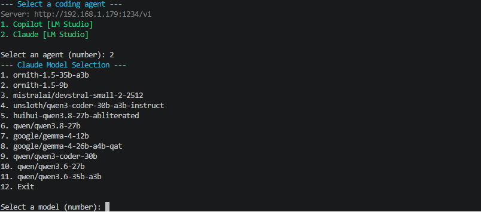

# Local Agent Launcher

**Version: 0.1**

A Windows PowerShell launcher that lets you choose **Copilot** or **Claude Code**,
select a model, and start the agent against your model server. With LM Studio,
it loads the selected model and unloads other language models before launching.

## Requirements

- Windows with Windows PowerShell 5.1 or PowerShell 7.
- The selected client installed and available on `PATH`: `copilot.exe` for Copilot
  or `claude` for Claude Code. The Copilot installation must support the provider
  environment variables listed below.
- A running model server reachable from this computer, with a downloaded language
  model suitable for coding and tool calling. The launcher does not install
  clients, start servers, or download models.

| Server mode | Server requirements | Model management |
| --- | --- | --- |
| `LMStudio` (default) | LM Studio 0.4.0+ for the native API; 0.4.1+ when using Claude Code | The launcher checks, unloads, and loads models. |
| `LlamaCpp` (alias `llama.cpp`) | Running `llama-server`; a build with `/v1/messages` support for Claude Code | Discovery through `/v1/models`; llama.cpp manages loading and unloading. |
| `OpenAICompatible` | `/v1/models` for discovery and the inference API required by the chosen client | The server manages loading and unloading. |

Claude Code requires an **Anthropic-compatible `/v1/messages` endpoint**. An
OpenAI-compatible chat endpoint alone is not sufficient. See the
[LM Studio API changelog](https://lmstudio.ai/docs/developer/api-changelog) for
API version requirements.

## Quick start

1. Install the client you want to use and open a new PowerShell terminal.
2. Start LM Studio's API server and download a suitable language model.
3. From this directory, run:

```powershell
.\Start-LocalAgent.ps1 -BaseUrl http://localhost:1234
```

Choose **1. Copilot** or **2. Claude**, then choose a model number. In LM Studio
mode, the menu includes downloaded models that are not loaded yet. Models already
in memory show `(loaded: instance-id)`. Choose **Exit** to leave without launching
an agent or changing loaded models.



**The default address is `http://localhost:1234/v1`, or
`http://localhost:8080/v1` with `-ServerType LlamaCpp`.** Supply `-BaseUrl` for
another host or port. The URL can be the server root or end in `/v1`; a trailing
slash is accepted.

To skip the agent menu:

```powershell
.\Start-LocalAgent.ps1 -Client Claude -BaseUrl http://localhost:1234
.\Start-LocalAgent.ps1 -Client Copilot -BaseUrl http://localhost:1234
```

To use a LAN server, substitute its address for `localhost`. The server must
accept connections from this computer.

To launch Claude with `--bare --exclude-dynamic-system-prompt-sections` and the
selected model:

```powershell
.\Start-LocalAgent.ps1 -Client Claude -Min
```

## Parameters

| Parameter | Default | Description |
| --- | --- | --- |
| `-Client` | Interactive menu | `Copilot` or `Claude`. Skips the agent menu; model selection remains interactive. |
| `-BaseUrl` | `http://localhost:1234/v1` (`http://localhost:8080/v1` for llama.cpp) | HTTP(S) server root or URL ending in `/v1`. An explicit URL overrides the server-mode default. Do not include credentials, a query, or a fragment. |
| `-ServerType` | `LMStudio` | `LMStudio`, `LlamaCpp` (alias `llama.cpp`), or `OpenAICompatible`. Set this explicitly for servers other than LM Studio. |
| `-ClaudeAuthToken` | `$env:LM_API_TOKEN` | Token for discovery and LM Studio model management for either client, and for Claude inference. See authentication below. |
| `-Min` | Off | Adds `--bare --exclude-dynamic-system-prompt-sections` to the Claude launch alongside `--model`. Has no effect for Copilot. |
| `-ShowVersion` | Off | Prints `Local Agent Launcher version 0.1` and exits without contacting the server. |
| `-Help` | Off | Displays script help and exits without contacting the server. |

```powershell
.\Start-LocalAgent.ps1 -ShowVersion
.\Start-LocalAgent.ps1 -Help
```

## Model loading in LM Studio

Before launching either client, on localhost or a LAN server, the launcher:

1. Refreshes the server's model list after you make a selection.
2. Unloads every loaded instance of other language models. Embedding models are
   excluded from the menu and remain loaded.
3. Reuses a loaded instance of the selected model, or loads the model if needed.
   If several instances of the selected model exist, it uses the first returned
   by the server and leaves the others loaded.
4. Passes the confirmed instance ID to the client, including custom instance names.

A failed status check, unload, or load stops the launch. If switching fails after
unloading an old model, the launcher does not reload it automatically. Unloading
a model also affects other sessions using that model server.

The launcher uses LM Studio's existing load settings; it does not set context
length or GPU allocation. Configure these in LM Studio. For Claude Code, use a
suitable context window for coding tasks; the
[LM Studio integration guide](https://lmstudio.ai/docs/integrations/claude-code)
provides setup guidance. Models remain loaded when the client exits, subject to
LM Studio's own lifecycle settings.

## Authentication

If your server requires authentication, set `LM_API_TOKEN` in the current
PowerShell session before running the launcher:

```powershell
$env:LM_API_TOKEN = 'replace-with-your-server-token'
.\Start-LocalAgent.ps1 -Client Claude -BaseUrl http://localhost:1234
```

You can also pass `-ClaudeAuthToken` to override the environment variable. Despite
its name, this parameter supplies the launcher's discovery and model-management
requests for **both** clients. Claude also receives it as `ANTHROPIC_AUTH_TOKEN`.
When no token is supplied, Claude uses the placeholder `lmstudio`, suitable for
servers with authentication disabled.

Version 0.1 does **not** configure a Copilot inference API token. If authentication
is enabled, configure authentication supported by your Copilot installation
separately; successful model loading alone does not establish Copilot's access.

## Claude Code

Install Claude Code using the
[official setup instructions](https://code.claude.com/docs/en/setup). For WinGet:

```powershell
winget install Anthropic.ClaudeCode
```

Claude runs in the current terminal and working directory. To work in another
project, change to that directory and invoke the launcher by its full path.

The launcher temporarily sets Claude's server, authentication, model aliases,
and default subagent model, clears conflicting provider environment variables,
and disables nonessential Claude network traffic. It restores the previous
process environment when Claude exits and does not edit Claude settings files.

After model selection, the launcher sets `CLAUDE_CODE_MAX_CONTEXT_TOKENS` from
the server's actual loaded context configuration and prints the detected size:

- **LM Studio:** uses the selected instance's `config.context_length` from
  `/api/v1/models`. When loading a new instance, it requests `echo_load_config`
  and uses the returned `load_config.context_length`.
- **llama.cpp:** requests `/props?model=<selected-model>` and uses
  `default_generation_settings.n_ctx`, the per-slot context size. The model ID
  is URL-encoded to support paths, aliases, and servers routing multiple models.
- **OpenAICompatible:** warns and leaves the variable unset for that launch,
  because this API has no standard field for the loaded context size. An
  inherited value is temporarily cleared to avoid using another model's limit.

LM Studio and llama.cpp launches of Claude stop if the context size is missing,
invalid, or cannot be fetched. The launcher does not substitute the model's
theoretical maximum or change the server's context allocation. Copilot does not
require context detection. `DISABLE_COMPACT = 1` remains enabled for Claude,
disabling automatic and manual compaction independently of the detected size.

Use `/status` in Claude Code to inspect the connection. Settings files and explicit
model overrides in custom agents can still affect which provider or model is used.
Claude Code is the client; this launcher does not provide Anthropic's proprietary
Claude models for local inference. Tools, plugins, and MCP servers can still make
network requests.

## Copilot

Copilot launches as a separate process through `copilot.exe`. The child process
inherits these settings; the caller's previous environment is then restored:

| Environment variable | Value |
| --- | --- |
| `COPILOT_PROVIDER_BASE_URL` | The selected server's `/v1` URL |
| `COPILOT_PROVIDER_TYPE` | `openai` |
| `COPILOT_MODEL` | The selected model or confirmed LM Studio instance ID |
| `COPILOT_OFFLINE` | `true` |

Support for these settings depends on your Copilot installation. The launcher
does not enforce network isolation.

## llama.cpp

Start `llama-server` with a coding model and tool calling enabled, for example:

```powershell
llama-server -m C:\models\coder.gguf --alias local-coder --jinja --port 8080
```

Replace the example model path with your GGUF file. Then launch either client:

```powershell
.\Start-LocalAgent.ps1 -Client Claude -ServerType LlamaCpp
.\Start-LocalAgent.ps1 -Client Copilot -ServerType llama.cpp
```

Use `-BaseUrl http://your-server:8080` for a remote server or custom address.
Both spellings use `/v1/models` for discovery, preserve the advertised model ID
(file path or alias), and skip LM Studio's management API. `OpenAICompatible`
also works with llama.cpp when its address is supplied explicitly.

Claude needs a llama.cpp build that implements `/v1/messages`; tool use requires
`--jinja` and a suitable model/chat template. See the
[llama.cpp server documentation](https://github.com/ggml-org/llama.cpp/blob/master/tools/server/README.md).
For a server started with `--api-key`, pass the same key through
`-ClaudeAuthToken` for discovery and Claude inference. Copilot authentication
still needs separate configuration as described above.

## Other compatible servers

Use `-ServerType OpenAICompatible` to discover models through `/v1/models` without
calling LM Studio's management API. For example, with a running Ollama server
that supports the Anthropic Messages API:

```powershell
.\Start-LocalAgent.ps1 -Client Claude -ServerType OpenAICompatible -BaseUrl http://localhost:11434
```

Select a downloaded local model for local inference. See
[Ollama's Claude Code integration](https://docs.ollama.com/integrations/claude-code)
for server setup. Changing `-BaseUrl` alone does not change the server type.

## Troubleshooting

| Symptom | What to check |
| --- | --- |
| Client not found | Install the selected client, open a new terminal, and check that `claude` or `copilot.exe` is on `PATH`. |
| Failed to fetch models | Check `-BaseUrl`, server status, network access, and authentication. For llama.cpp, pass `-ServerType LlamaCpp`; for other compatible servers, use `-ServerType OpenAICompatible`. |
| No models returned | Download a language model in LM Studio. In compatible mode, make a suitable model available through the server's `/v1/models` endpoint. |
| Selected model no longer available | The server's model list changed while the menu was open. Run the launcher and select again. |
| Failed to unload or load | Check the server logs, token permissions, and available memory. Resolve the error before retrying. |
| Cannot determine the context size | Check the selected instance's context configuration and server API support. LM Studio must return `config.context_length` or echoed `load_config.context_length`; llama.cpp must expose `default_generation_settings.n_ctx` through `/props`. |
| Claude uses an unexpected provider or model | Check `/status`, Claude settings files, and custom agent model overrides. |

## Validation

The test suite uses Pester 3.4/4 syntax. Run it from this directory with a compatible
Pester version loaded:

```powershell
Invoke-Pester .\Start-LocalAgent.Tests.ps1
```

The version 0.1 checks cover menus, URL handling, environment restoration, model
reuse and switching, instance IDs, and failures that must prevent launch. They use
simulated servers and clients, so they do not load real models or start coding
sessions. llama.cpp checks also cover both server-type spellings, default and
custom addresses, model paths and aliases, authentication forwarding, and
discovery failures. Context checks cover loaded and newly loaded instances,
selection-specific limits, llama.cpp per-slot sizes, invalid or missing values,
and environment restoration.

Live end-to-end validation with LM Studio, llama.cpp, Copilot, and Claude Code is still
outstanding; automated test results do not establish compatibility with every
client version or model.

## References

- [LM Studio model management API](https://lmstudio.ai/docs/developer/rest)
- [Claude Code environment variables](https://code.claude.com/docs/en/env-vars)
